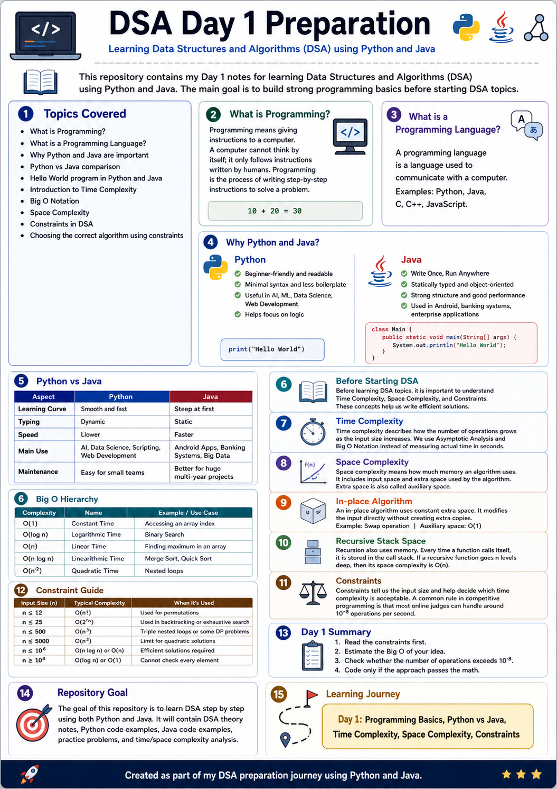

# DSA Day 1 Preparation

This repository contains my Day 1 notes for learning **Data Structures and Algorithms (DSA)** using **Python and Java**.

The main goal of this repository is to build strong programming basics before starting DSA topics.

---

## Day 1 Assets

- `Day1.png` - Day 1 cover image
- `Dsa_Day_1.pdf` - Day 1 notes PDF (with `Day1.png` inserted as page 1)
- `python/day1_max_number.py` - Small Day 1 Python program
- `java/Day1MaxNumber.java` - Small Day 1 Java program

### Cover Preview



---

## Topics Covered

- What is Programming?
- What is a Programming Language?
- Why Python and Java are important
- Python vs Java comparison
- Hello World program in Python and Java
- Introduction to Time Complexity
- Big O Notation
- Space Complexity
- Constraints in DSA
- How to choose the correct algorithm using constraints

---

## 1. What is Programming?

Programming means giving instructions to a computer.

A computer cannot think by itself. It only follows instructions written by humans.

Example:

```text
10 + 20 = 30
```

A calculator gives the answer because it is programmed to add numbers.

So, programming is the process of writing step-by-step instructions to solve a problem.

---

## 2. What is a Programming Language?

A programming language is a language used to communicate with a computer.

Examples of programming languages:

- Python
- Java
- C
- C++
- JavaScript

In this DSA preparation journey, I am learning **Python and Java** together.

---

## 3. Why Python and Java?

## Python

Python is beginner-friendly and easy to read.

Python is built on the principle of **readability**. It is designed to look similar to English, which makes it easier for beginners to understand.

### Why Python is Powerful

- Simple and minimal syntax
- Less boilerplate code
- Easy to learn for beginners
- Useful in Data Science, AI, Machine Learning, and Web Development
- Helps focus more on logic than syntax

### Python Example

```python
print("Hello World")
```

---

## Java

Java follows the principle:

```text
Write Once, Run Anywhere
```

Java is a statically typed and object-oriented programming language.

### Why Java is Powerful

- Strong structure
- Statically typed
- Object-oriented
- Good performance
- Used in large-scale applications
- Commonly used in Android apps, banking systems, and enterprise projects

### Java Example

```java
class Main {
    public static void main(String[] args) {
        System.out.println("Hello World");
    }
}
```

---

## 4. Python vs Java

| Feature | Python | Java |
|---|---|---|
| Learning Curve | Smooth and fast | Steep at first |
| Typing | Dynamic | Static |
| Speed | Slower | Faster |
| Main Use | AI, Data Science, Scripting, Web Development | Android Apps, Banking Systems, Big Data |
| Maintenance | Easy for small teams | Better for huge multi-year projects |

---

# Before Starting DSA

Before learning DSA topics, it is important to understand:

- Time Complexity
- Space Complexity
- Constraints

These concepts help us write efficient solutions.

---

## 5. Time Complexity

Time complexity describes how the number of operations grows as the input size increases.

We do not measure time in seconds because different computers may run the same code at different speeds.

Instead, we use **Asymptotic Analysis** and **Big O Notation**.

---

## 6. Big O Notation

Big O notation is used to describe the efficiency of an algorithm.

It tells us how fast or slow an algorithm grows when input size increases.

## Big O Hierarchy

From fastest to slowest:

| Big O | Name | Example |
|---|---|---|
| O(1) | Constant Time | Accessing an array index |
| O(log n) | Logarithmic Time | Binary Search |
| O(n) | Linear Time | Finding maximum in an array |
| O(n log n) | Linearithmic Time | Merge Sort, Quick Sort |
| O(n²) | Quadratic Time | Nested loops |

---

## 7. Space Complexity

Space complexity means how much memory an algorithm uses.

It includes:

- Input space
- Extra space used by the algorithm

Extra space is also called **auxiliary space**.

---

## 8. In-place Algorithm

An in-place algorithm uses constant extra space.

It modifies the input directly without creating extra copies.

Example:

```text
Swap operation
```

Auxiliary space:

```text
O(1)
```

---

## 9. Recursive Stack Space

Recursion also uses memory.

Every time a function calls itself, it is stored in the call stack.

If a recursive function goes `n` levels deep, then its space complexity is:

```text
O(n)
```

---

## 10. Constraints

Constraints tell us the input size.

They help us decide which time complexity is acceptable.

A common rule used in competitive programming:

```text
Most online judges can handle around 10^8 operations per second.
```

So before coding, we should estimate whether our solution can pass within the time limit.

---

## 11. Constraint Guide

| Input Size | Target Complexity | Explanation |
|---|---|---|
| n ≤ 12 | O(n!) | Used for permutations |
| n ≤ 25 | O(2ⁿ) | Used in backtracking or exhaustive search |
| n ≤ 500 | O(n³) | Triple nested loops or some DP problems |
| n ≤ 5000 | O(n²) | Limit for quadratic solutions |
| n ≤ 10⁶ | O(n log n) or O(n) | Efficient solutions required |
| n ≥ 10⁸ | O(log n) or O(1) | Cannot check every element |

---

## 12. Day 1 Summary

Before writing code:

1. Read the constraints first.
2. Estimate the Big O of your idea.
3. Check whether the number of operations exceeds `10^8`.
4. Code only if the approach passes the math.

---

## Repository Goal

The goal of this repository is to learn DSA step by step using both Python and Java.

This repository will contain:

- DSA theory notes
- Python code examples
- Java code examples
- Practice problems
- Time complexity analysis
- Space complexity analysis

---

## Learning Journey

```text
Day 1: Programming Basics, Python vs Java, Time Complexity, Space Complexity, Constraints

```

---

## Author

Created as part of my DSA preparation journey using Python and Java.
